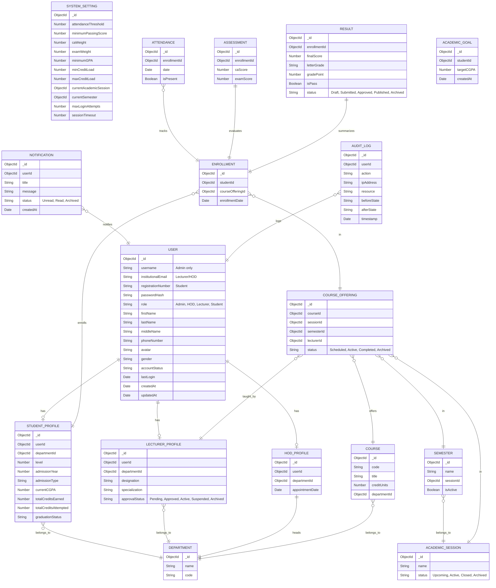
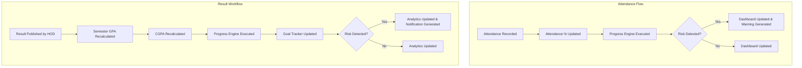
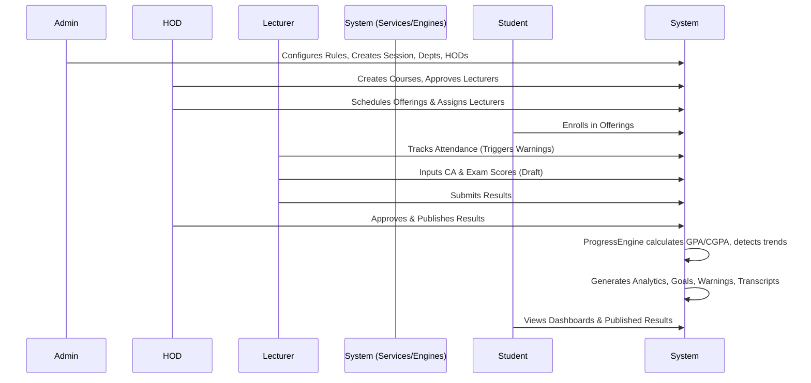

# Web-Based Academic Progress Tracking System (WAPTS) - Revised Architecture Plan

This document outlines the revised architecture, structure, schemas, and workflows for WAPTS, incorporating all architectural corrections including centralized user management, strict state machines, event-driven workflows, and a permission matrix.

## User Review Required
> [!IMPORTANT]
> Please review this completely revised architecture plan. We need your explicit approval on the folder structure, entity relationships, database schemas, route map, service contracts, permission matrix, state machines, event flows, dashboard specs, and system workflow before beginning implementation.

## 1. Folder Structure
```text
WAPTS/
├── config/             # DB connection, passport, env variables, system config defaults
├── controllers/        # Request handling, validation integration, standard responses
├── middlewares/        # Auth, Permission Matrix checks, error handling, rate limiting
├── models/             # Mongoose schemas (User, StudentProfile, Result, AuditLog, etc.)
├── routes/             # Express routes definition mapped to controllers
├── services/           # Core business logic (ProgressEngine, AuthService, etc.)
├── seeders/            # Seed data (Admin, HODs, Lecturers, Students, Courses, Results)
├── utils/              # Helper functions, logger (Morgan setup), API response formatter
├── views/              # EJS templates
│   ├── admin/          # Admin specific views (widgets)
│   ├── hod/            # HOD specific views (widgets)
│   ├── lecturer/       # Lecturer specific views (widgets)
│   ├── student/        # Student specific views (widgets)
│   ├── layouts/        # Dashboard layout, general layouts
│   └── partials/       # Reusable components (navbar, sidebar, cards, modals)
├── public/             # Static files
│   ├── css/            # Vanilla CSS
│   ├── js/             # Vanilla JavaScript, Chart.js integrations
│   └── images/         # Static images/assets
├── uploads/            # Multer local storage (Profiles, CSVs, Transcripts)
├── app.js              # Express app setup, middlewares, error handler
├── server.js           # Server entry point
└── package.json        # Dependencies and scripts
```

## 2 & 3. Entity Relationship Diagram & Database Schemas


## 4. Route Map

| Prefix | Endpoint | Method | Role | Description |
|---|---|---|---|---|
| `/auth` | `/login`, `/logout` | GET/POST | All | Authentication endpoints |
| `/admin` | `/dashboard` | GET | Admin | Admin analytics & widgets |
| `/admin` | `/settings` | GET/PUT | Admin | Manage system configuration |
| `/admin` | `/departments`, `/sessions` | GET/POST/PUT | Admin | Manage depts, sessions & semesters |
| `/admin` | `/users` | GET/POST/PUT | Admin | Manage HOD accounts, generic users |
| `/admin` | `/audit-logs` | GET | Admin | View audit logs |
| `/hod` | `/dashboard` | GET | HOD | HOD department widgets |
| `/hod` | `/lecturers` | GET/PUT | HOD | Approve lecturer profiles |
| `/hod` | `/courses` | GET/POST/PUT | HOD | Manage department courses |
| `/hod` | `/allocations` | GET/POST | HOD | Assign lecturers (Course Offerings) |
| `/hod` | `/results/approve` | GET/POST | HOD | Review & Approve submitted results |
| `/lecturer` | `/dashboard` | GET | Lecturer | Lecturer widgets |
| `/lecturer` | `/courses/:id/attendance` | GET/POST | Lecturer | Manage attendance |
| `/lecturer` | `/courses/:id/assessments`| GET/POST | Lecturer | Upload CA/Exam scores |
| `/lecturer` | `/courses/:id/results` | GET/POST(Submit)| Lecturer | Save as Draft / Submit results |
| `/student` | `/dashboard` | GET | Student | Student progress & widgets |
| `/student` | `/courses` | GET | Student | Enrollments & attendance |
| `/student` | `/results` | GET | Student | View Published results |
| `/student` | `/goals` | GET/POST | Student | Academic goals & tracker |
| `/student` | `/transcript` | GET | Student | Download transcript |
| `/api` | `/notifications` | GET/PUT | All | Manage notifications |

## 5. Service Contracts
Each service communicates with models and is invoked by controllers.

- **AuthService**: Login, password hashing, session creation.
- **UserService**: User CRUD, profile management, avatar uploads.
- **DepartmentService**: Department CRUD.
- **SessionService & SemesterService**: Academic calendar management, state transitions.
- **CourseService & CourseOfferingService**: Course catalog and allocations.
- **EnrollmentService**: Student course registration.
- **AttendanceService**: Attendance tracking, boolean flags.
- **AssessmentService**: CA/Exam handling.
- **ResultService**: Final score calculation, grade assignment, draft/submit/approve/publish workflow.
- **TranscriptService**: Generate transcripts based on published results.
- **NotificationService**: In-app notifications.
- **ProgressService** (Academic Progress Engine): `calculateSemesterGPA()`, `calculateCGPA()`, `calculateCreditCompletion()`, `calculateGraduationProgress()`, `calculateAttendancePercentage()`, `calculateAttendanceTrend()`, `calculateSemesterTrend()`, `detectPerformanceImprovement()`, `detectPerformanceDecline()`, `detectWeakCourses()`, `detectStrongCourses()`, `detectAcademicRisk()`, `calculateGoalProjection()`, `generateAcademicSummary()`, `generateDashboardMetrics()`.
- **AnalyticsService**: Aggregates data for dashboards.
- **GoalService**: Academic goals management.
- **AuditService**: Logs sensitive actions securely.
- **SettingsService**: Reads/writes configurable rules (System Settings).

## 6. Permission Matrix
| Operation | Admin | HOD | Lecturer | Student |
|---|:---:|:---:|:---:|:---:|
| **Manage Users (Create HOD, etc.)** | ✔ | ✘ | ✘ | ✘ |
| **Manage System Config** | ✔ | ✘ | ✘ | ✘ |
| **Manage Departments & Sessions** | ✔ | ✘ | ✘ | ✘ |
| **View Audit Logs** | ✔ | ✘ | ✘ | ✘ |
| **Approve Lecturers** | ✘ | ✔ | ✘ | ✘ |
| **Manage Courses & Allocations** | ✘ | ✔ | ✘ | ✘ |
| **Approve Results** | ✘ | ✔ | ✘ | ✘ |
| **Publish Results** | ✘ | ✔ | ✘ | ✘ |
| **Manage Attendance & Assessments** | ✘ | ✘ | ✔ (Assigned) | ✘ |
| **Submit Results** | ✘ | ✘ | ✔ (Assigned) | ✘ |
| **View Analytics** | ✔ (System) | ✔ (Dept) | ✔ (Class) | ✔ (Self) |
| **Read Published Results** | ✔ | ✔ | ✔ | ✔ (Self) |

## 7. State Machines
Enforced at the Service layer:
- **Lecturer**: `Pending` -> `Approved` -> `Active` -> `Suspended` -> `Archived`
- **Result**: `Draft` -> `Submitted` -> `Approved` -> `Published` -> `Archived`
- **Course Offering**: `Scheduled` -> `Active` -> `Completed` -> `Archived`
- **Notification**: `Unread` -> `Read` -> `Archived`
- **Academic Session**: `Upcoming` -> `Active` -> `Closed` -> `Archived`

## 8. Event Flow Diagrams (Event-Driven Rules)


## 9. Dashboard Specifications (Widgets)
- **Student Dashboard**: Current GPA Card, Current CGPA Card, Credits Earned Card, Credits Remaining Card, Attendance Card, Goal Progress Card, Academic Warning Card, Semester Trend Chart, Attendance Trend Chart, Weak Courses Table, Strong Courses Table, Notifications Panel, Upcoming Deadlines.
- **Lecturer Dashboard**: Assigned Courses Table, Pending Submissions Tracker, Average Score KPI, Pass Rate KPI, Fail Rate KPI, Attendance Statistics Chart, Grade Distribution Chart, Student Risk Summary Table, Notifications.
- **HOD Dashboard**: Department Statistics, Department GPA, Department Pass Rate, Students At Risk List, Lecturer Workload Table, Course Performance Table, Enrollment Statistics, Pending Result Approvals Table, Notifications.
- **Admin Dashboard**: Departments Count, Students Count, Lecturers Count, Active Sessions Info, System Usage Metrics, Storage Statistics (Multer), Recent Activity Feed, Audit Logs Panel.

## 10. System Workflow

