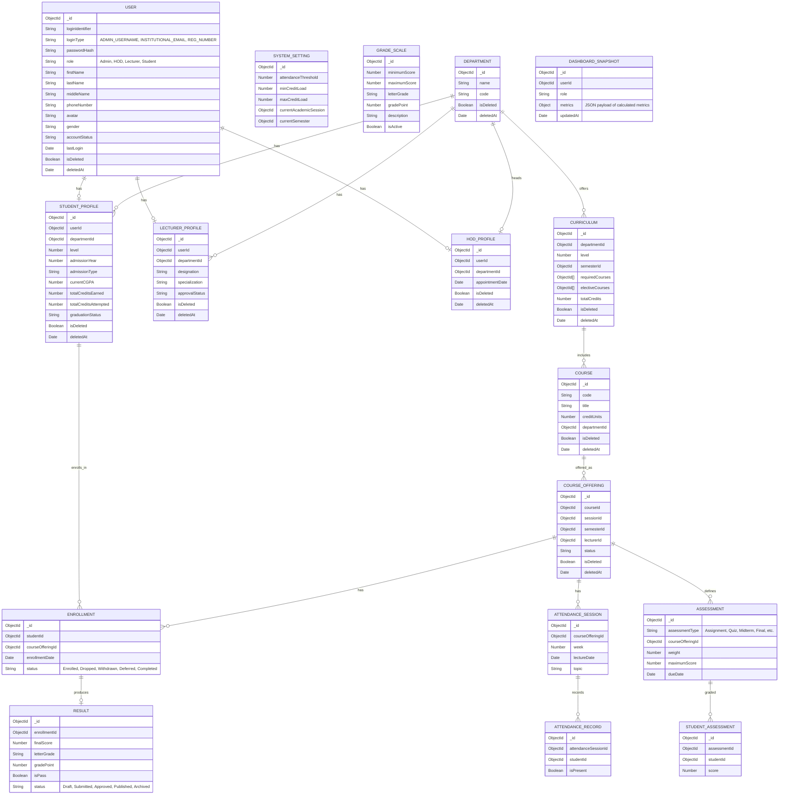
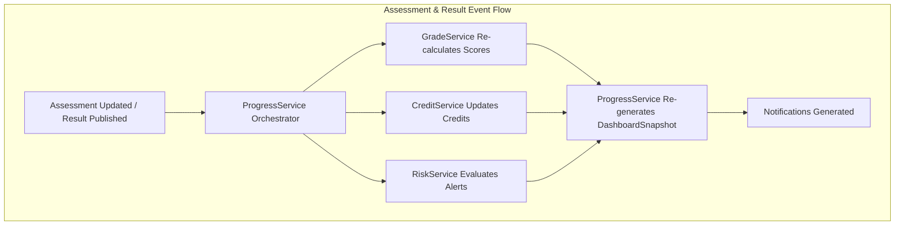
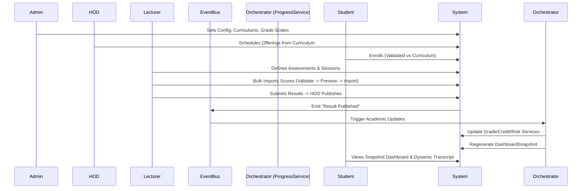

# Web-Based Academic Progress Tracking System (WAPTS) - Final Architecture Plan

This document outlines the final, amended architecture for WAPTS, incorporating all architectural corrections including centralized user management, normalized attendance and assessments, dynamic transcript generation, optimized dashboards, soft delete policies, and a comprehensive event-driven workflow.

## User Review Required
> [!IMPORTANT]
> Please review this final architecture plan. We need your explicit approval on the updated folder structure, entity relationships, database schemas, route map, service contracts, permission matrix, state machines, event flows, dashboard specs, and system workflow before beginning implementation.

## 1. Folder Structure
```text
WAPTS/
├── config/             # DB, passport, env, system config defaults
├── controllers/        # Request handling, response formatting
├── middlewares/        # Auth, Permissions, express-validator, error handler, rate limit
├── models/             # Mongoose schemas (User, Curriculum, DashboardSnapshot, etc.)
├── routes/             # Express routes definition
├── services/           # Core business logic (Auth, Progress, Risk, Grade, etc.)
├── seeders/            # Seed data scripts
├── utils/              # Helper functions, logger, API response formatter, CSV parser
├── views/              # EJS templates (Admin, HOD, Lecturer, Student, layouts)
├── public/             # Static CSS, JS (Chart.js), images
├── uploads/            # Multer local storage (Profiles, CSV bulk imports, Transcripts)
├── app.js              # Express app setup
└── server.js           # Server entry point
```

## 2 & 3. Entity Relationship Diagram & Database Schemas


## 4. Route Map (Standardized with Pagination & Validation)

| Prefix | Endpoint | Method | Role | Description |
|---|---|---|---|---|
| `/auth` | `/login`, `/logout` | GET/POST | All | Uses `loginIdentifier` & `loginType` |
| `/admin` | `/dashboard` | GET | Admin | Reads from DashboardSnapshot |
| `/admin` | `/settings`, `/grade-scales` | GET/PUT | Admin | System and Grade configurations |
| `/admin` | `/departments`, `/curriculums` | GET/POST/PUT | Admin | Manage departments & curriculums |
| `/admin` | `/users` | GET/POST/PUT/DEL| Admin | Soft delete enforced. |
| `/hod` | `/dashboard` | GET | HOD | Reads from DashboardSnapshot |
| `/hod` | `/allocations` | GET/POST | HOD | Manage Course Offerings |
| `/hod` | `/results/approve` | GET/POST | HOD | Review/Approve results |
| `/lecturer` | `/dashboard` | GET | Lecturer| Reads from DashboardSnapshot |
| `/lecturer` | `/courses/:id/attendance`| GET/POST | Lecturer| Manage Attendance Sessions & Records |
| `/lecturer` | `/courses/:id/assessments`| GET/POST | Lecturer| Define Assessments & Upload Scores |
| `/student` | `/dashboard` | GET | Student | DashboardSnapshot + Classifications |
| `/student` | `/courses` | GET/POST | Student | Enroll in Curriculum courses |
| `/student` | `/transcript` | GET | Student | Dynamic generation |
| `/import` | `/csv` | POST | Adm/HOD/Lec | Bulk upload (Validate->Preview->Confirm->Import) |

## 5. Service Contracts

- **AuthService**: Handles `loginIdentifier` & `loginType`.
- **GradeService**: Grade conversion, lookup based on `GradeScale` model.
- **CreditService**: Calculates earned/attempted credits and graduation credit progress.
- **RiskService**: Detects academic risks, generates warnings and alerts.
- **ReportService**: Dynamically generates transcripts and academic summaries.
- **ProgressService (Orchestrator)**: Orchestrates Grade, Credit, Risk, and Report services. Re-generates `DashboardSnapshot`.
- **EnrollmentService**: Validates enrollments against Curriculum.
- **AttendanceService**: Manages Sessions and Records.
- **AssessmentService**: Manages flexible assessment types and calculations.
- **ResultService**: Draft/Submit/Approve/Publish states. Calculates final scores using `Assessment` weights.
- **SchedulerService (node-cron)**: Archives expired items, refreshes dashboards, session rollovers.
- **ImportService**: Orchestrates CSV Upload -> Validate -> Preview -> Confirm -> Import workflow.

## 6. Permission Matrix
| Operation | Admin | HOD | Lecturer | Student |
|---|:---:|:---:|:---:|:---:|
| **Manage System Config & Grades** | ✔ | ✘ | ✘ | ✘ |
| **Manage Curriculums & Depts** | ✔ | ✘ | ✘ | ✘ |
| **Approve Lecturers & Allocations**| ✘ | ✔ | ✘ | ✘ |
| **Approve/Publish Results** | ✘ | ✔ | ✘ | ✘ |
| **Manage Assessments & Attendance**| ✘ | ✘ | ✔ | ✘ |
| **Enroll in Courses** | ✘ | ✘ | ✘ | ✔ |
| **View Own Transcripts/Results** | ✘ | ✘ | ✘ | ✔ |
| **Bulk Import Data** | ✔ | ✔ | ✔(Scores)| ✘ |

## 7. State Machines
- **Enrollment**: `Enrolled` -> `Dropped` | `Withdrawn` | `Deferred` | `Completed`
- **Result**: `Draft` -> `Submitted` -> `Approved` -> `Published` -> `Archived`
- **Course Offering**: `Scheduled` -> `Active` -> `Completed` -> `Archived`
- **Lecturer**: `Pending` -> `Approved` -> `Active` -> `Suspended` -> `Archived`

## 8. Event Flow Diagrams


## 9. Dashboard Specifications (Snapshot Driven)
Calculated offline/asynchronously on events. Displayed on read:
- **Student Dashboard**: Current/Expected Classification, Remaining CGPA to next class, Attendance %, Credits info.
- **Lecturer Dashboard**: Pending Submissions, Pass/Fail Rates, Assessment Distributions.
- **HOD Dashboard**: Dept GPA, Students At Risk, Pending Result Approvals.
- **Admin Dashboard**: System metrics, Storage Stats, Audit Logs.

## 10. System Workflow

