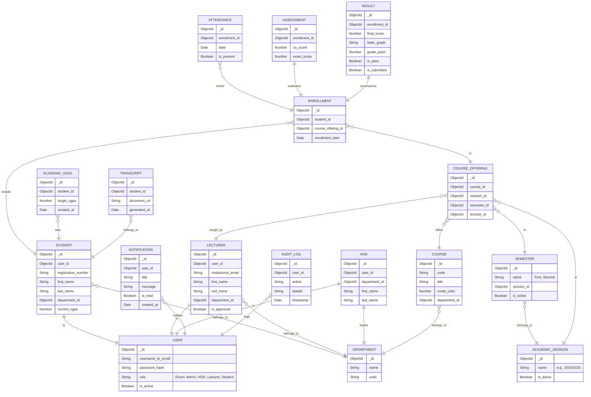
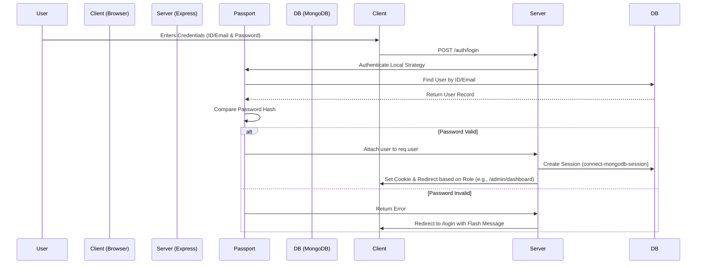
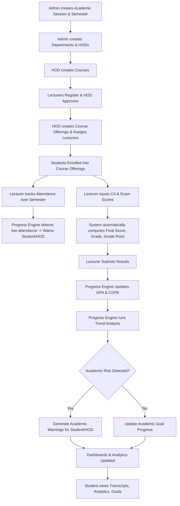

# Web-Based Academic Progress Tracking System (WAPTS) - Implementation Plan

This document outlines the architecture, structure, schemas, and workflows for WAPTS, a platform designed to continuously track, analyze, and visualize student academic progress alongside standard academic record management.

## User Review Required
> [!IMPORTANT]
> Please review this comprehensive architecture and planning document. We need your explicit approval on the architecture, folder structure, schemas, route map, and workflows before we begin implementation and code generation.

## 1. Project Architecture
The application will follow a strict Modular MVC (Model-View-Controller) architecture enriched with a Service layer to encapsulate business logic.
- **Frontend**: EJS (Server-Side Rendering), Vanilla JS, HTML5, CSS3. Chart.js for analytics.
- **Backend**: Node.js, Express.js.
- **Database**: MongoDB with Mongoose ODM.
- **Authentication**: Passport.js (Local Strategy), Express Sessions stored in MongoDB via `connect-mongodb-session`.
- **Flow**: Request -> Route -> Middleware (Auth/Role/Validation) -> Controller -> Service -> Model -> Database.

## 2. Folder Structure
```text
WAPTS/
├── config/             # DB connection, passport config, environment variables
├── controllers/        # Request handling and response formatting (grouped by entity/role)
├── middlewares/        # Auth, role checking, error handling, input validation
├── models/             # Mongoose schemas and models
├── routes/             # Express routes definition
├── services/           # Core business logic, academic progress engine, GPA calculations
├── utils/              # Helper functions, constants, logger
├── views/              # EJS templates
│   ├── admin/          # Admin specific views
│   ├── hod/            # HOD specific views
│   ├── lecturer/       # Lecturer specific views
│   ├── student/        # Student specific views
│   └── partials/       # Reusable components (navbar, sidebar, cards, modals)
├── public/             # Static files
│   ├── css/            # Vanilla CSS
│   ├── js/             # Vanilla JavaScript for interactivity, Chart.js integrations
│   └── images/         # Static images/assets
├── uploads/            # User-uploaded files (e.g., profile pictures, bulk uploads)
├── app.js              # Express app setup and middleware configuration
├── server.js           # Server entry point
└── package.json        # Dependencies and scripts
```

## 3 & 6. Database Schema Diagram & Entity Relationships


## 4. Route Map

| Prefix | Endpoint | Method | Role | Description |
|---|---|---|---|---|
| `/auth` | `/login` | GET/POST | All | User login |
| `/auth` | `/logout` | GET | All | User logout |
| `/admin` | `/dashboard` | GET | Admin | Admin analytics dashboard |
| `/admin` | `/departments` | GET/POST/PUT/DELETE | Admin | Manage departments |
| `/admin` | `/sessions` | GET/POST/PUT | Admin | Manage sessions & semesters |
| `/admin` | `/hods` | GET/POST/PUT | Admin | Manage HOD accounts |
| `/hod` | `/dashboard` | GET | HOD | HOD department analytics |
| `/hod` | `/lecturers` | GET/POST(Approve) | HOD | Manage/Approve lecturers |
| `/hod` | `/courses` | GET/POST/PUT | HOD | Manage department courses |
| `/hod` | `/allocations` | GET/POST | HOD | Assign lecturers to courses (Offerings) |
| `/hod` | `/students` | GET | HOD | Monitor student performance/warnings |
| `/lecturer` | `/dashboard` | GET | Lecturer | Lecturer analytics & assigned courses |
| `/lecturer` | `/courses/:id/attendance` | GET/POST | Lecturer | Record course attendance |
| `/lecturer` | `/courses/:id/assessments`| GET/POST | Lecturer | Upload CA/Exam scores |
| `/lecturer` | `/courses/:id/results` | GET/POST | Lecturer | Review/Submit final results |
| `/student` | `/dashboard` | GET | Student | Student analytics, GPA/CGPA trends |
| `/student` | `/courses` | GET | Student | View enrolled courses & attendance |
| `/student` | `/results` | GET | Student | View semester results |
| `/student` | `/goals` | GET/POST | Student | Set/View academic goals |
| `/student` | `/transcript` | GET | Student | View/Download transcript |
| `/api` | `/notifications` | GET/PUT | All | Fetch/Read notifications |

## 5. Authentication Flow


## 7. System Workflow (Academic Cycle & Progress Engine)


## Proposed Execution Plan
1. **Setup & Initialization**: Initialize Node.js project, install dependencies, set up modular folder structure.
2. **Database & Models**: Implement all Mongoose models with proper validation, timestamps, and indexes.
3. **Core Middlewares**: Setup Passport.js authentication, session management, and role-based authorization guards.
4. **Services (The Engines)**: Implement the GPA Engine, CGPA Engine, and the Academic Progress Engine (trend analysis, risk detection).
5. **Controllers & Routes**: Implement business logic handlers and connect them via Express routes.
6. **Frontend (EJS & Vanilla JS)**: Build responsive layouts using raw CSS, implement dashboards, partials, and Chart.js integration.
7. **Testing & Refinement**: Verify workflows and enforce role boundaries.
